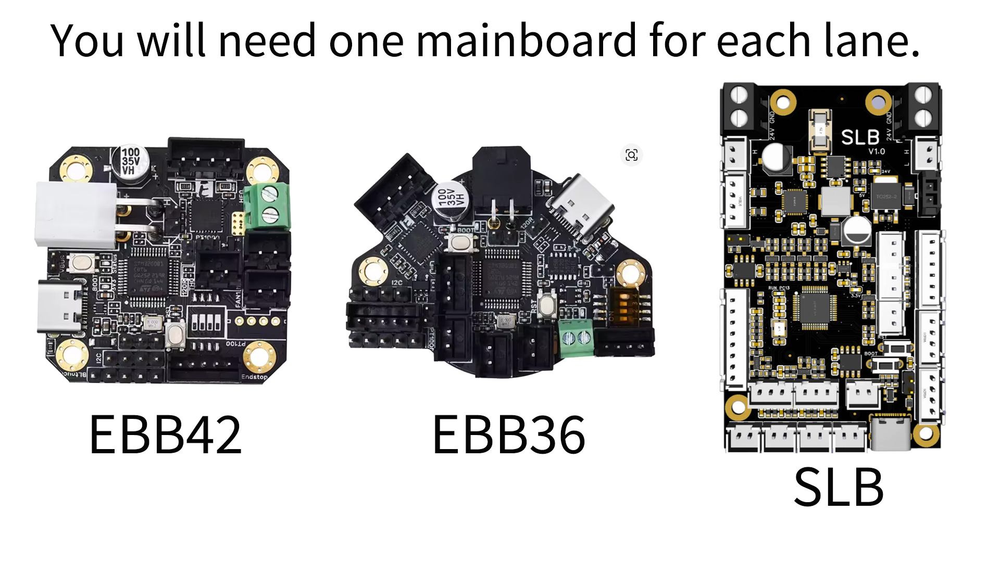
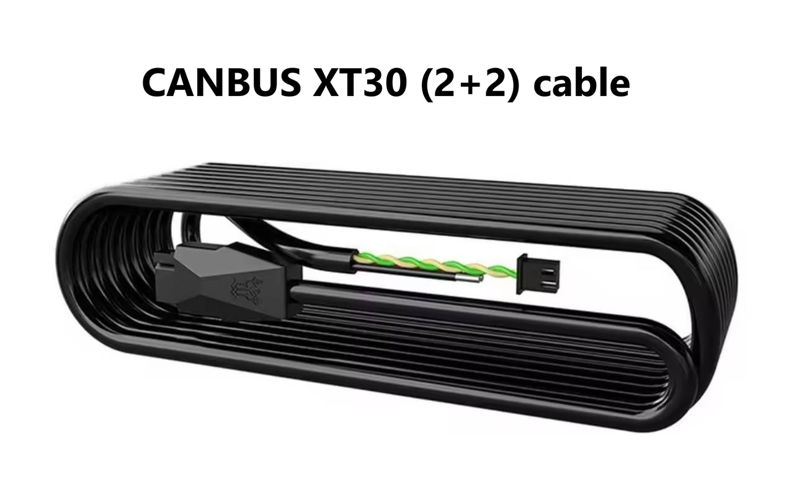
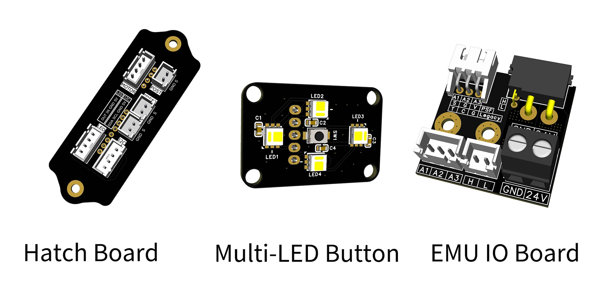

# EMU-Kit
This is a comprehensive hardware kit for the EMU (Expandable Multi-material Unit), an open-source multi-material system. This kit is designed to provide a seamless building experience by gathering all necessary high-quality components in one package.

## Scope of the Kit

This kit is strictly organized based on the **[Official EMU BOM](https://docs.google.com/spreadsheets/d/1jYJXBgpc_iLDfC17fC2LTYKrSEy5ocPbGEQ_EEOGCvI)**. It includes all mechanical parts, motors, and electronic components required to complete the build, with the following **exceptions**:

- **Mainboard (MCU):** To allow for user preference (e.g., [BTT EBB42](https://www.aliexpress.com/item/1005004242828520.html), [BTT EBB36](https://www.aliexpress.com/item/1005004242828520.html), or our custom-designed **[SLB Mainboard](https://github.com/kashine6/SLB-Board-For-EMU)**), the main controller is **not included**. The number of required mainboards matches the number of lanes.
- **CANBUS Cable:** The **XT30 (2+2) cable** used to interface the EMU with your 3D printer is **not included**. Recommend purchasing the **BigTreeTech XT30(2+2) Cable**.
- **Mainboard Terminals:** Since most MCUs come with their own connectors, this kit **does not include** the terminals typically bundled with your mainboard (such as JST XH/PH), with the exception of **Dupont connectors** which are included.

## Integrated Enhancements (Included)

We have upgraded the base EMU experience by including the following integrated MOD boards:

1. **[Hatch Board](https://github.com/DW-Tas/EMU/tree/main/PCB%20(recommended%20options)/hatch_board):** Simplifies internal sensor wiring and creates a much cleaner internal layout.
2. **[Multi-LED Button](https://github.com/DW-Tas/EMU/tree/main/PCB%20(recommended%20options)/multi_led_button):** Provides a high-quality physical interface with RGB status indicators for manual filament control.
3. **[EMU IO Board](https://github.com/kashine6/EMU-IO-Board):** Centralizes connections and enhances the overall input/output reliability of the unit.

## Documentation & Support

Detailed assembly guides, wiring diagrams for the integrated PCBs, and Klipper configuration snippets can be found here:

- [GitHub: DW-Tas/EMU](https://github.com/DW-Tas/EMU)

## Support the Project

**$2.5 per lane** of EMU kit sold is contributed directly to [DW-Tas](https://github.com/DW-Tas) and [igiannakas](https://github.com/igiannakas) to support the ongoing development of the project.

